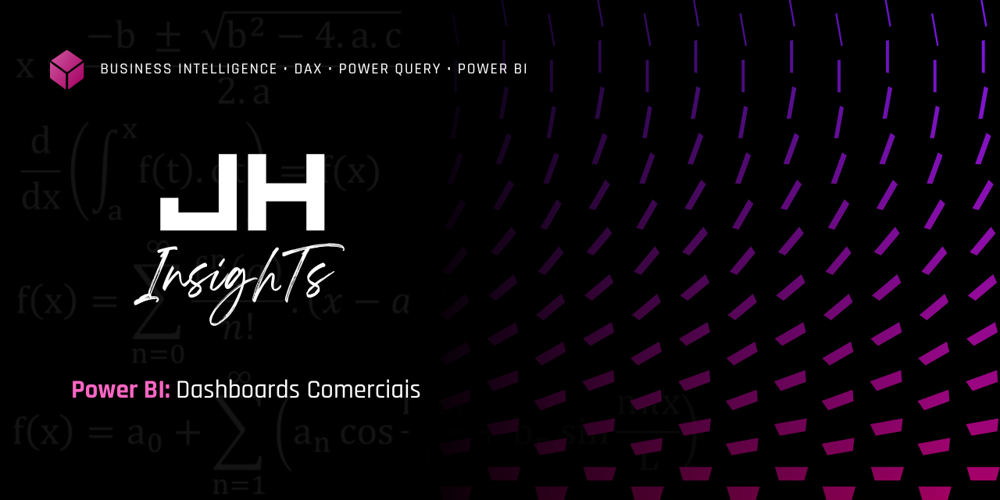
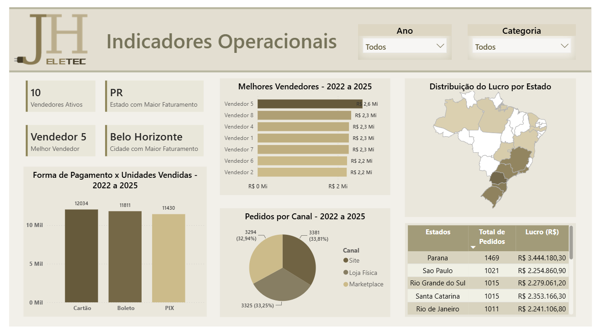
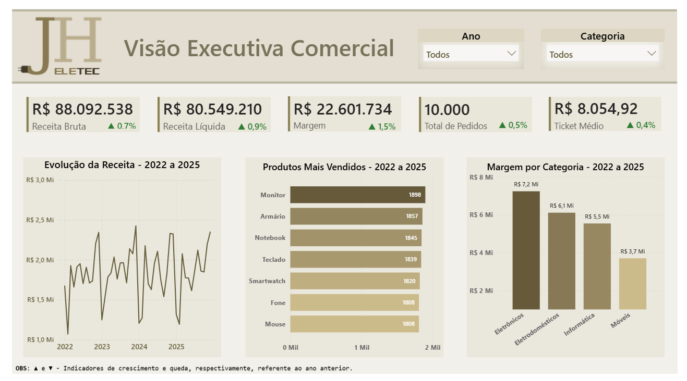
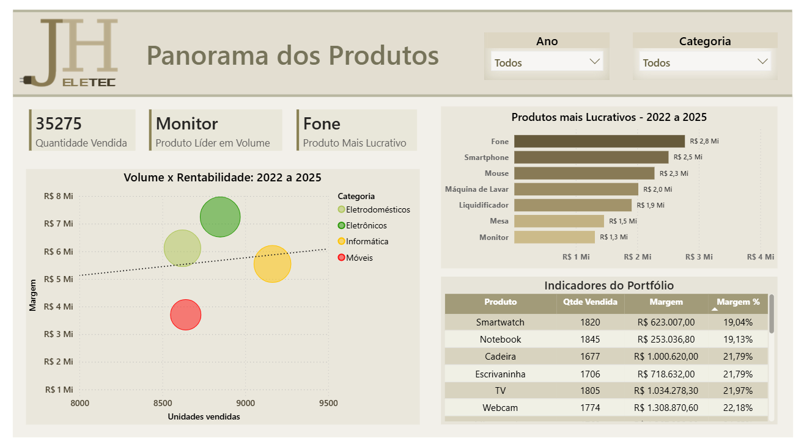

# POWER BI - Dashboards

  

## 📊 JHInsighTs | Commercial Sales Dashboard
Dashboard desenvolvido em Power BI com foco em análise comercial, acompanhamento de indicadores de desempenho e geração de insights para apoio à tomada de decisão.

## 📌 Sobre o Projeto

Este projeto consiste no desenvolvimento de um **Dashboard Comercial em Power BI**, criado com o objetivo de transformar dados de vendas em informações estratégicas para apoio à tomada de decisão.

A solução apresenta uma visão analítica do desempenho comercial, permitindo acompanhar indicadores financeiros, evolução temporal, desempenho de produtos e distribuição geográfica das vendas.

Os dados utilizados foram simulados para representar um cenário comercial realista, permitindo a aplicação de técnicas de modelagem, análise e visualização de dados.

A identidade visual, incluindo nome, logotipo e elementos gráficos, foi desenvolvida como parte da construção deste portfólio, buscando uma apresentação profissional e consistente.

---

## 🎯 Objetivos

O dashboard foi desenvolvido para responder perguntas como:

- Qual o desempenho das vendas ao longo do tempo?
- Quais produtos possuem maior participação na receita?
- Quais categorias apresentam melhor margem?
- Como as vendas estão distribuídas por região?
- Quais indicadores comerciais precisam de acompanhamento?

---

## 🏗️ Modelagem de Dados

O projeto utiliza um modelo dimensional em **Star Schema (Modelo Estrela)**.

### Tabela Fato

📌 **Fato_Vendas**

Principais informações:

- Receita
- Quantidade vendida
- Descontos
- Impostos
- Margem
- Vendedores

### Tabelas Dimensão

📅 **Dim_Data**

- Ano
- Mês
- Período

📦 **Dim_Produto**

- Produto
- Categoria
- Preço

👥 **Dim_Cliente**

- Características dos clientes

📍 **Dim_Localização**

- Cidade
- Estado

---

## 🛠️ Tecnologias Utilizadas

| Tecnologia | Aplicação |
|---|---|
| Power BI | Construção dos dashboards |
| Power Query | Tratamento e transformação dos dados |
| DAX | Criação de medidas e indicadores |
| Excel / CSV | Armazenamento dos dados |

> Os dados utilizados foram simulados com apoio de Inteligência Artificial para representar um cenário comercial realista.

---

## 📈 Indicadores Desenvolvidos

### Indicadores Financeiros

- Receita Bruta
- Receita Líquida
- Lucro
- Margem %

### Indicadores Comerciais

- Quantidade de pedidos
- Ticket médio
- Produtos mais vendidos
- Análise por categoria
- Evolução mensal das vendas

---

## 📊 Dashboards

### Dashboard Operacional

Visão geral dos principais indicadores operacionais.

  

### Dashboard Comercial

Análise de:

- Receita ao longo do tempo
- Categorias
- Desempenho financeiro
- Indicadores de vendas

  

### Dashboard Produtos

Análise de:

- Ranking de produtos
- Participação na receita
- Margem por produto

  

---

## 🧮 Principais Medidas DAX

- Receita Total
- Receita Líquida
- Lucro Total
- Margem %
- Ticket Médio
- Crescimento Mensal

---

## 🔎 Principais Insights

📈 **Faturamento**
- O período de maior faturamento ocorreu no ano de 2023, com participação na receita em 25,52%.

🌎 **Distribuição geográfica**
- O estado do Paraná apresentou a maior participação no faturamento, representando 15,24% da receita total.

🏆 **Produtos**
- O produto "Fone" apresentou a maior contribuição para o lucro, destacando-se como um dos principais responsáveis pelo desempenho financeiro.

📅 **Sazonalidade**
- Foi identificado aumento nas vendas durante os meses de Novembro e Dezembro.

---

## 💡 Principais Aprendizados

Durante o desenvolvimento foram aplicados conceitos de:

✅ Modelagem dimensional  
✅ Relacionamentos entre tabelas  
✅ Criação de medidas DAX  
✅ Tratamento de dados com Power Query  
✅ Storytelling com dados  
✅ Construção de dashboards orientados ao negócio

---

## 👨‍💻 Autor

**João Henrique Fernandes dos Santos**

Engenheiro Químico em transição para Business Intelligence | Power BI | Data Analytics

GitHub: https://github.com/JHInsighTs
